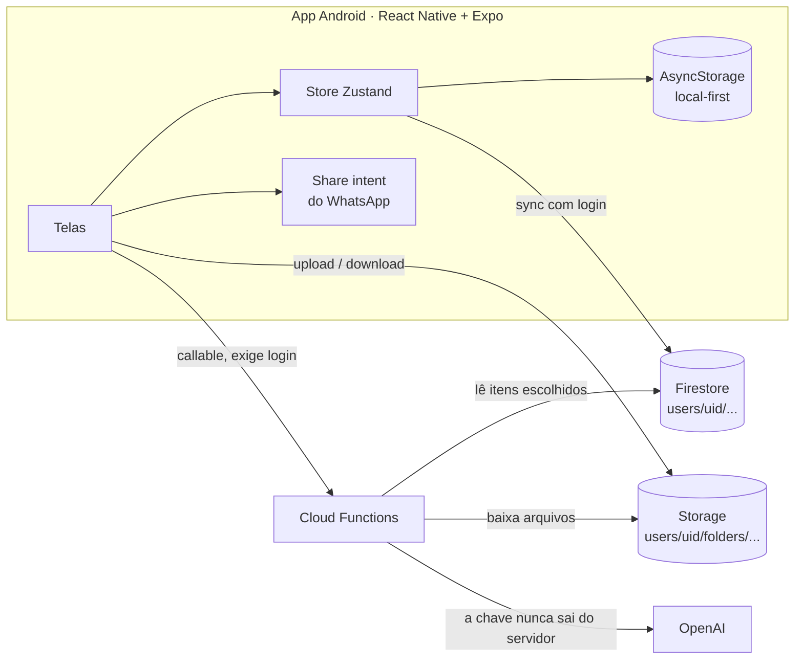

# BeHappier · um app que eu fiz para a minha namorada

**BeHappier é um app Android que eu projetei e construí sozinho para a Amalia, minha namorada, que é neurodivergente.** Ele ajuda ela a perceber os padrões de energia e do ciclo menstrual sem nenhuma cobrança de produtividade, tem um chat de apoio com IA e virou o companheiro de estudos dela na faculdade: pastas por matéria para tudo que chega das aulas e uma IA tutora que responde a partir do material dela.

## Por que eu fiz

A Amalia queria um lugar só dela pra entender a própria energia e o ciclo, sem app de produtividade cobrando metas, e depois pediu ajuda com a faculdade: o material das aulas chegava espalhado em grupos do WhatsApp e se perdia. Em vez de procurar um app pronto que resolvesse mais ou menos, eu construí um do jeito que ela precisa. Cada tela nasceu de uma conversa com ela, e é ela quem testa cada versão. Ela quis que esta vitrine contasse essa história.

**Código-fonte:** privado (guarda dados pessoais e de saúde dela). Este repositório é uma vitrine pública: arquitetura, decisões de engenharia e alguns trechos de código representativos com testes. Mostro o código privado com prazer numa entrevista.

## Resumo

| | |
|---|---|
| **Papel** | Tudo sozinho: produto, UX, app, backend, prompts de IA, publicação e suporte (a Amalia reporta os bugs pelo WhatsApp) |
| **App** | React Native 0.86 + Expo SDK 57, TypeScript, Zustand, React Navigation · ~8.700 linhas em 60 arquivos |
| **Backend** | Firebase: Auth, Firestore, Storage e 4 Cloud Functions (Node 22) · ~570 linhas |
| **IA** | OpenAI: chat de apoio e sugestão pós check-in (`gpt-4o-mini`), tutora de estudos que lê PDF, Word, slides e fotos (`gpt-6-luna`), transcrição de voz |
| **Distribuição** | APK assinado e compilado localmente, instalado por link privado (sem loja) |

## O que ele faz

- **Check-in diário:** energia (1 a 5), "o que você acha que causou isso?" com 26 fatores (sobrecarga sensorial, masking, sono ruim, interação social…), humor opcional e nota. Depois a IA dá uma sugestão gentil e concreta, com botão "conversar sobre isso".
- **Padrões:** gráfico de energia e humor, resumo da semana, energia por fase do ciclo e insights por regras explicáveis ("*barulho* aparece bastante nos seus dias de pouca energia").
- **Ciclo (estilo Flo):** anel das fases, calendário com todas as fases pintadas, detecção de atraso, histórico de ciclos reais com média automática, fluxo e sintomas por dia.
- **Chat de apoio:** texto, fotos e mensagens de voz. A IA recebe um resumo curto dos check-ins recentes e da fase do ciclo, então ela não precisa explicar a semana toda vez.
- **Tutora de estudos:** várias conversas salvas; ela manda foto do caderno ou da prova, PDF, Word ou áudio e pede resumos, explicações ou exercícios. Respostas longas viram um PDF bonito, gerado no próprio celular, pronto pra mandar no WhatsApp ou imprimir.
- **Pastas por matéria:** uma grade colorida, uma pasta por matéria. Fotos, PDFs, slides, áudios e anotações ficam na conta dela (Firebase Storage), então nada se perde em conversa velha do WhatsApp nem na troca de celular.
- **Compartilhar do WhatsApp:** no WhatsApp ela segura o arquivo, toca em *Compartilhar*, escolhe o app e a pasta. Essa era a dor real: material de aula chega espalhado em grupos.
- **Perguntar pra IA sobre itens escolhidos:** ela segura itens de uma pasta, toca em *Perguntar pra IA* e ganha uma conversa baseada exatamente naquele material. O servidor lê os arquivos do Storage, então o celular não reenvia nada.
- **Privacidade:** login na abertura, contas criadas só por mim no console, todo caminho do Firestore e do Storage restrito ao próprio usuário, e um botão "apagar todos os meus registros" que limpa o celular, os documentos na nuvem e os arquivos (LGPD).

## Arquitetura

Mais diagramas (fluxo das pastas e como o contexto da IA é montado) em [docs/architecture.md](docs/architecture.md).

## Destaques de engenharia

| Problema | O que eu fiz | Código |
|---|---|---|
| Com atraso, o ingênuo `dias % duração` começava um ciclo novo em silêncio, bem quando ela mais precisa saber que está atrasada | A contagem continua (dia 31, 32…) durante o atraso; dias futuros no calendário supõem que vem amanhã; a média só usa ciclos reais plausíveis | [cycle-day.js](snippets/cycle-day.js) |
| Ela pediu nenhum travessão nos textos, mas LLMs continuam usando "—" como pausa mesmo instruídos | Instrução em todo prompt **e** um filtro determinístico no celular em toda resposta da IA | [without-dashes.js](snippets/without-dashes.js) |
| Slides de aula chegam em `.pptx`, que o modelo não lê | A função descompacta o arquivo e extrai o texto na ordem numérica (slide10 depois do slide2), com cache por item depois da primeira leitura | [slides-text.js](snippets/slides-text.js) |
| "Perguntar sobre estes itens" podia explodir o custo ou ignorar arquivos em silêncio | Orçamento no servidor: mais recentes primeiro, limite de caracteres e de fotos, e o que fica de fora volta como aviso pro app | [material-budget.js](snippets/material-budget.js) |
| Reenviar todo PDF e foto a cada mensagem é lento e caro no 4G | Só a mensagem nova leva arquivos; o servidor devolve o texto extraído, que o app guarda e reenvia como texto depois | [study-history.js](snippets/study-history.js) |
| O app tem que funcionar offline e sobreviver à troca de celular | Store local-first espelhado no Firestore; no login os registros são unidos por id e o que só existia no celular sobe | [merge-logs.js](snippets/merge-logs.js) |

Todos os trechos são simplificados do app e cobertos por testes em [snippets/test](snippets/test) (`npm test`, 17 casos, sem dependências).

## Pensado para ela

- **Sem linguagem de produtividade.** Os textos validam o descanso ("tudo bem desacelerar") e a fase lútea diz que baixar a régua é cuidado, não fraqueza.
- **Pouco esforço pra registrar.** Um check-in são poucos toques; "não sei dizer" é resposta válida e nunca vira insight.
- **Recomendação, não lição de casa.** Com energia baixa ela marca o que pesou e o app sugere o que fazer; ela não precisa saber o remédio.
- **Os pedidos dela viram regra.** Nenhum travessão nos textos, sem faixa de linha de apoio na interface (a IA ainda orienta ajuda se ela relatar crise), uma funcionalidade que confundia foi removida.
- **Ciclo curto de feedback.** Ela reporta pelo WhatsApp; eu corrijo, gero o APK e mando o link novo, muitas vezes no mesmo dia.

## Publicação e operação

- APK compilado localmente com Gradle e compartilhado por link privado do Expo; uma única chave de assinatura, então a atualização instala por cima.
- Regras de segurança do Firestore e do Storage no repositório, publicadas com o Firebase CLI; as regras do Storage também limitam o tamanho do arquivo.
- A chave da OpenAI fica só no Secret Manager do Firebase e toda função exige usuário logado; o app não tem tela de cadastro, as contas são criadas no console.

## O que eu aprendi

- **Construir para alguém que você conhece é a melhor escola de produto.** Cada funcionalidade veio de uma dificuldade de verdade, e os bugs chegam como print no WhatsApp em vez de ticket.
- **React Native tem arestas no manuseio de arquivos.** Blob tem que ser criado via XHR, Blob fechado dá erro em qualquer acesso (um bug que eu publiquei e corrigi no mesmo dia) e abrir um arquivo em outro app exige URI `content://` no Android.
- **Modelo barato com bom contexto vence modelo caro.** Escolher qual material entra no prompt importou mais do que o modelo.

## Sobre mim

Sou **Abner Duarte**, do Brasil: analista de suporte técnico (N2/N3 e implantação) migrando para suporte em nuvem e engenharia de software. Falo inglês fluente e estou estudando para certificações AWS. Também construí o [ZapSync](https://github.com/darkslipx/zapsync-showcase), um SaaS multi-tenant de atendimento com IA no WhatsApp.
GitHub: [@darkslipx](https://github.com/darkslipx)

---

O app BeHappier e seu código-fonte são privados. Os trechos de código em [`snippets/`](snippets) são liberados sob a licença MIT.
