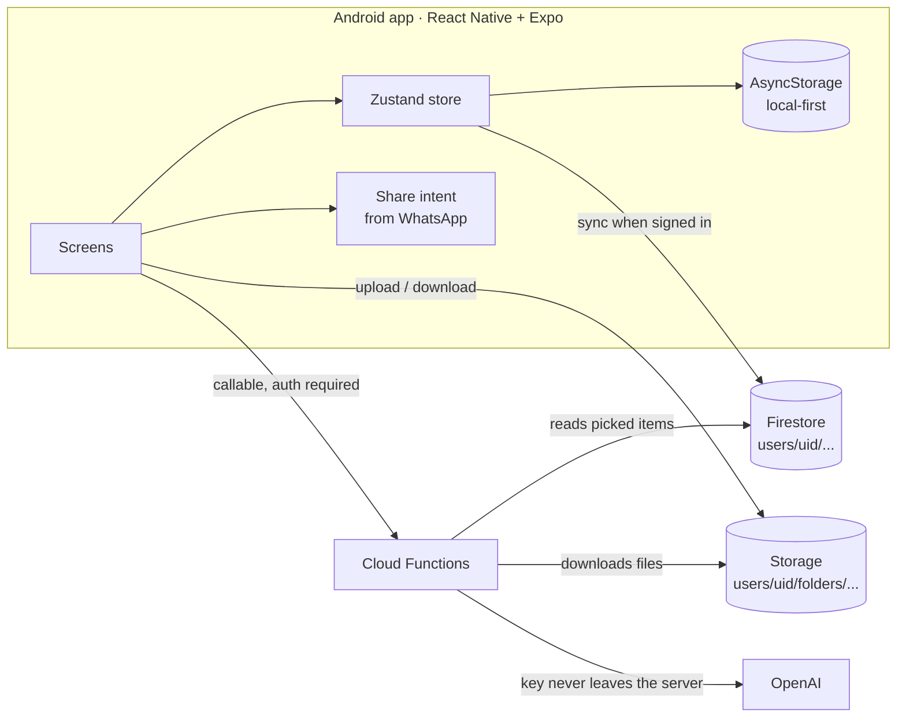

# BeHappier · a gentle companion app for a neurodivergent woman

> 🇧🇷 [Leia em português](README.pt-BR.md)

**BeHappier is an Android app I designed and built on my own for one real user: someone close to me who is neurodivergent.** It helps her notice her energy patterns and menstrual cycle without any productivity pressure, gives her a supportive AI chat, and turned into her study companion for university: subject folders for everything she gets from class, and an AI tutor that answers from her own material.

**Source code:** private (it holds a real person's health-related data model and was built for her). This repository is a public showcase: architecture, engineering decisions and a few representative code excerpts with tests. I'm happy to walk through the private code in an interview.

## At a glance

| | |
|---|---|
| **Role** | Solo: product, UX, mobile app, backend, AI prompts, release and support (the user is a real person who reports bugs on WhatsApp) |
| **App** | React Native 0.86 + Expo SDK 57, TypeScript, Zustand, React Navigation · ~8,700 lines across 60 files |
| **Backend** | Firebase: Auth, Firestore, Storage and 4 Cloud Functions (Node 22) · ~570 lines |
| **AI** | OpenAI: support chat and post check-in suggestions (`gpt-4o-mini`), study tutor that reads PDFs, Word, slides and photos (`gpt-6-luna`), voice transcription |
| **Distribution** | Signed APK built locally, sideloaded through a private link (no store listing) |

## What it does

- **Daily check-in:** energy (1 to 5), "what do you think caused this?" with 26 factors (sensory overload, masking, poor sleep, social interaction…), optional mood and a note. Then the AI gives one gentle, concrete suggestion with a "talk about it" button.
- **Patterns:** energy and mood chart, weekly summary, energy by cycle phase and explainable rule-based insights ("*noise* shows up a lot on your low-energy days").
- **Cycle tracking (Flo-style):** phase ring, calendar with every phase painted, late-period detection, history of real cycles with an automatic average, flow and symptoms per day.
- **Support chat:** text, photos and voice messages. The AI gets a short summary of recent check-ins and the cycle phase, so she doesn't have to explain her week every time.
- **Study tutor:** several saved conversations; she sends photos of the notebook or an exam, PDFs, Word files or a voice note, and asks for summaries, explanations or practice questions. Long answers become a nicely formatted PDF, rendered on the phone, ready to share on WhatsApp or print.
- **Subject folders:** a colorful grid, one folder per subject. Photos, PDFs, slides, audio and notes are stored in her account (Firebase Storage), so nothing gets lost in old WhatsApp chats or a new phone.
- **Share from WhatsApp:** in WhatsApp she long-presses a file, taps *Share*, picks the app and chooses the folder. That was the actual pain point: class material arrives scattered across group chats.
- **Ask the AI about specific items:** she long-presses items in a folder, taps *Ask the AI*, and gets a conversation grounded in exactly that material. The server reads the files from Storage, so the phone never re-uploads anything.
- **Privacy:** login on launch, accounts created only by me in the console, every Firestore and Storage path scoped to the user, and an "erase all my records" button that wipes the phone, the cloud documents and the stored files (LGPD).

## Architecture

More diagrams (the study-folder flow and how the AI context is built) in [docs/architecture.md](docs/architecture.md).

## Engineering highlights

| Problem | What I did | Code |
|---|---|---|
| A late period made the naive `days % length` silently start a new cycle, right when she most needs to know she's late | The count keeps going (day 31, 32…) while late; future calendar days assume it starts tomorrow; the average uses only plausible real cycles | [cycle-day.js](snippets/cycle-day.js) |
| She asked for no dashes in any text, but LLMs keep using "—" as a pause even when told not to | Instruction in every prompt **and** a deterministic filter on the phone for every AI reply | [without-dashes.js](snippets/without-dashes.js) |
| Class slides arrive as `.pptx`, which the model can't read | The function unzips the file and extracts slide text in numeric order (slide10 after slide2), cached per item after the first read | [slides-text.js](snippets/slides-text.js) |
| "Ask about these items" could blow up cost or silently ignore files | Server-side budget: newest first, character and photo caps, and anything left out is reported back to the app | [material-budget.js](snippets/material-budget.js) |
| Resending every PDF and photo on each chat turn is slow and costly on mobile data | Only the newest message ships files; the server returns the extracted text, which the app stores and resends as text afterwards | [study-history.js](snippets/study-history.js) |
| The app must work offline and survive a phone change | Local-first store mirrored to Firestore; on sign-in logs are unioned by id and local-only entries are pushed up | [merge-logs.js](snippets/merge-logs.js) |

All excerpts are simplified from the app and covered by tests in [snippets/test](snippets/test) (`npm test`, 17 cases, no dependencies).

## Designing for one neurodivergent user

- **No productivity language.** Copy validates rest ("slowing down is fine") and the luteal phase text says lowering the bar is care, not weakness.
- **Low effort input.** A check-in is a few taps; "I don't know" is a valid answer and never feeds an insight.
- **Recommendations, not homework.** When energy is low she picks what weighed on her and the app suggests what to do; she isn't expected to know the remedy.
- **Her requests become rules.** No dashes in any text, no crisis-hotline banner in the interface (the AI still points to help if she describes a crisis), a feature she found confusing was removed.
- **Short feedback loop.** She reports issues by WhatsApp; I fix, rebuild the APK and send a new link, often the same day.

## Release and operations

- APK compiled locally with Gradle and shared through a private Expo link; one signing key, so updates install over the previous version.
- Firestore and Storage security rules in the repo, deployed with the Firebase CLI; Storage rules also cap file size.
- The OpenAI key lives only in Firebase Secret Manager and every callable requires a signed-in user; the app has no sign-up screen, accounts are created in the console.

## What I learned

- **Building for one real person is the best product school.** Every feature came from something she actually struggled with, and bugs reach me as a screenshot on WhatsApp instead of a ticket.
- **React Native has sharp edges in file handling.** Blobs must be created through XHR, a closed Blob throws on any access (a bug I shipped and fixed the same day), and opening a file in another app needs a `content://` URI on Android.
- **Cheap models plus good context beat expensive models.** Picking which material goes into the prompt mattered more than the model.

## About me

I'm **Abner Duarte**, from Brazil: technical support analyst (N2/N3 and implementation) moving into cloud support and software engineering. I speak English fluently and I'm studying for AWS certifications. I also built [ZapSync](https://github.com/darkslipx/zapsync-showcase), a multi-tenant SaaS for AI customer service on WhatsApp.
GitHub: [@darkslipx](https://github.com/darkslipx)

---

The BeHappier app and its source code are private. The code excerpts in [`snippets/`](snippets) are released under the MIT license.
