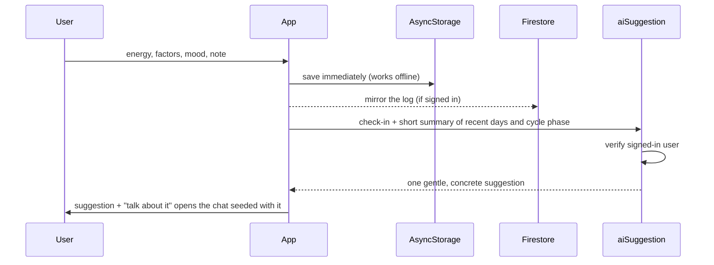
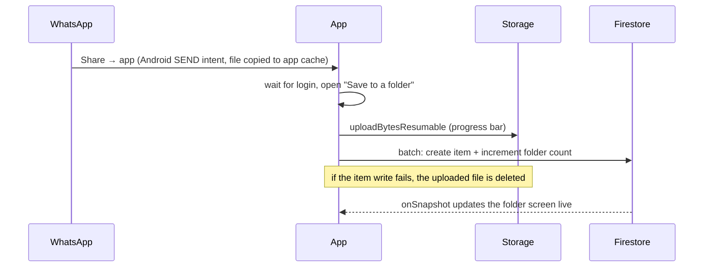
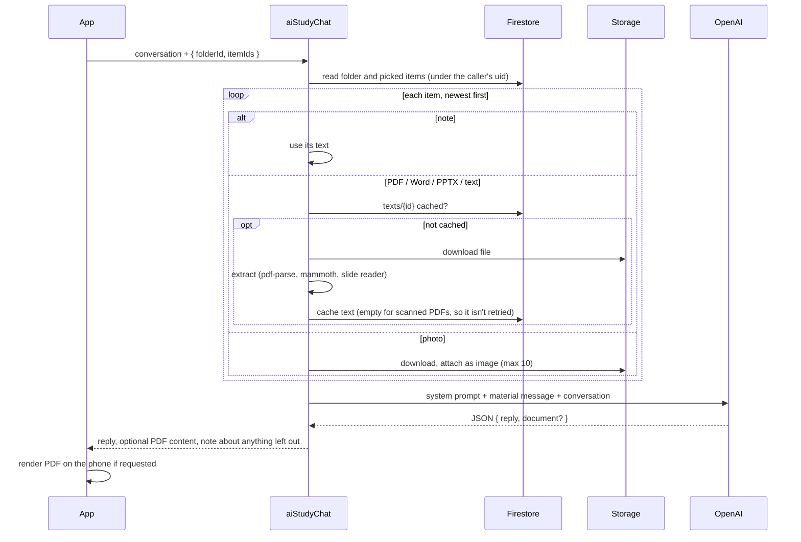

# Architecture

## Data layout

Everything belongs to one Firebase user and lives under their uid, so a single security rule (`request.auth.uid == userId`) protects all of it.

```
Firestore
  users/{uid}                              profile
  users/{uid}/meta/cycle                   current cycle + history of period starts
  users/{uid}/logs/{logId}                 check-ins
  users/{uid}/symptoms/{date}              flow and symptoms per day
  users/{uid}/folders/{folderId}           subject folder (name, color, icon, item count)
  users/{uid}/folders/{folderId}/items/{id}   photo, file or note
  users/{uid}/folders/{folderId}/texts/{id}   text extracted by the AI function (cache)

Storage
  users/{uid}/folders/{folderId}/{itemId}.{ext}   the files themselves (max 50 MB each)

Phone (AsyncStorage + app documents folder)
  profile, logs, cycle, symptoms          source of truth offline, mirrored to Firestore
  support chat and study conversations    phone-only, with their photos and PDFs
  cache of opened folder files            so the second open is instant
```

## Check-in to suggestion



## Subject folders and sharing from WhatsApp



## "Ask the AI" about picked items



The material is rebuilt on every turn from the cache, so the phone never re-uploads files and the AI never "forgets" them as the conversation grows.

## Why a callable for every AI feature

The OpenAI key is a Firebase secret, available only to the functions. The app calls them with `httpsCallable`, which sends the user's ID token; each function rejects unauthenticated calls before doing anything. There is no sign-up screen, so the only accounts are the ones created in the console.
