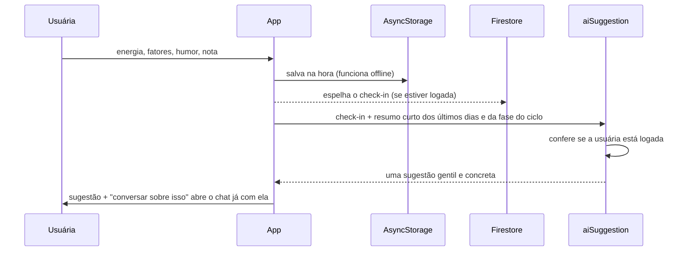
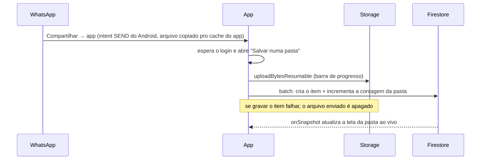
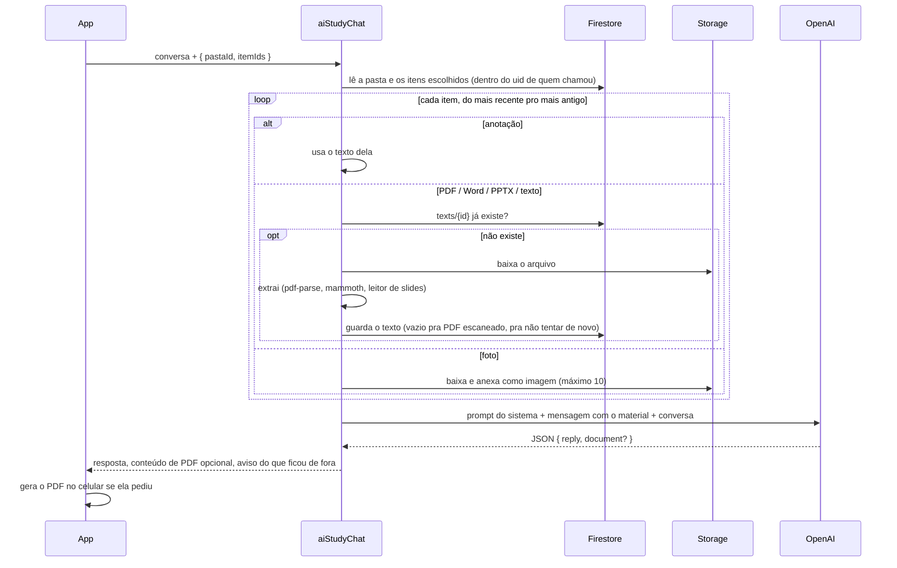

# Arquitetura

## Organização dos dados

Tudo pertence a um usuário do Firebase e fica dentro do uid dele, então uma única regra de segurança (`request.auth.uid == userId`) protege tudo.

```
Firestore
  users/{uid}                              perfil
  users/{uid}/meta/cycle                   ciclo atual + histórico de inícios da menstruação
  users/{uid}/logs/{logId}                 check-ins
  users/{uid}/symptoms/{data}              fluxo e sintomas por dia
  users/{uid}/folders/{pastaId}            pasta de matéria (nome, cor, ícone, contagem de itens)
  users/{uid}/folders/{pastaId}/items/{id}    foto, arquivo ou anotação
  users/{uid}/folders/{pastaId}/texts/{id}    texto extraído pela função de IA (cache)

Storage
  users/{uid}/folders/{pastaId}/{itemId}.{ext}   os arquivos em si (máximo 50 MB cada)

Celular (AsyncStorage + pasta de documentos do app)
  perfil, check-ins, ciclo, sintomas       fonte da verdade offline, espelhada no Firestore
  chat de apoio e conversas de estudo      só no celular, com as fotos e PDFs delas
  cache dos arquivos de pasta já abertos   pra segunda abertura ser instantânea
```

## Do check-in à sugestão



## Pastas de matéria e compartilhar do WhatsApp



## "Perguntar pra IA" sobre itens escolhidos



O material é montado de novo a cada pergunta a partir do cache, então o celular nunca reenvia arquivos e a IA não "esquece" o material quando a conversa cresce.

## Por que toda funcionalidade de IA é uma callable

A chave da OpenAI é um secret do Firebase, disponível só para as funções. O app chama as funções com `httpsCallable`, que envia o token de identidade da usuária, e cada função recusa chamadas sem login antes de fazer qualquer coisa. Não existe tela de cadastro, então as únicas contas são as criadas no console.
